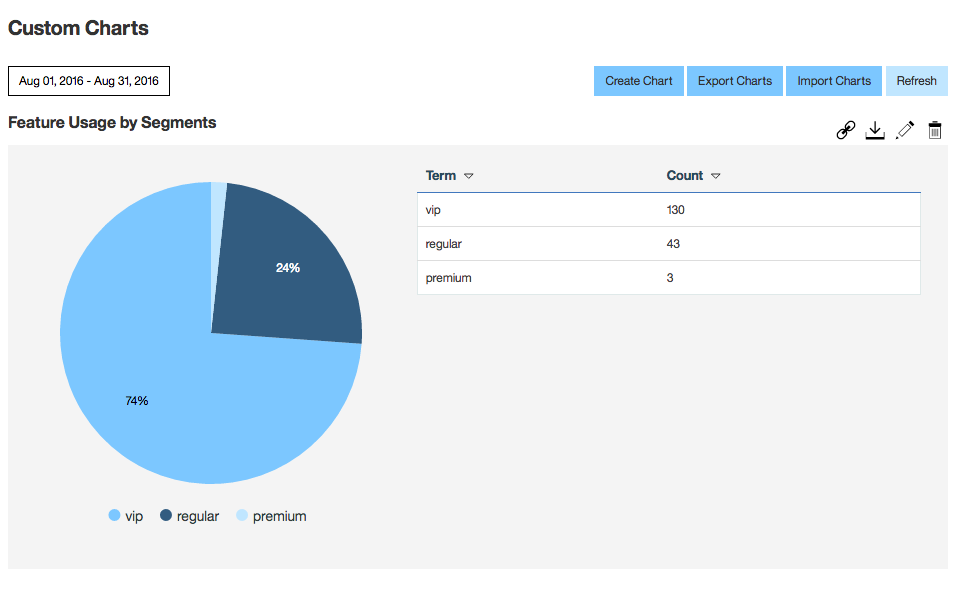

# Coupons App

The purpose of this sample is to demonstrate IBM MobileFirst Foundation features such as [Live Update](https://mobilefirstplatform.ibmcloud.com/tutorials/en/foundation/8.0/using-the-mfpf-sdk/live-update/), [Analytics](https://mobilefirstplatform.ibmcloud.com/tutorials/en/foundation/8.0/analytics/), [Adapters](https://mobilefirstplatform.ibmcloud.com/tutorials/en/foundation/8.0/adapters/) and [Security](https://mobilefirstplatform.ibmcloud.com/tutorials/en/foundation/8.0/authentication-and-security/).  This app sample using [AR](https://www.wikiwand.com/en/Augmented_reality) to shows coupons that which customers of a shop or business can picks, what can help the business get more traffic to the business.

### Demo

### Prerequisites
1. [Installed Git](https://git-scm.com/book/en/v2/Getting-Started-Installing-Git)
2. Pre-installed IBM MobileFirst Platform [development environment](https://mobilefirstplatform.ibmcloud.com/tutorials/en/foundation/8.0/setting-up-your-development-environment/).
3. Understanding the IBM MobileFirst Platform [Authentication and Security](https://mobilefirstplatform.ibmcloud.com/tutorials/en/foundation/8.0/authentication-and-security/).
4. Understanding the IBM MobileFirst Platform [Java Adapters](https://mobilefirstplatform.ibmcloud.com/tutorials/en/foundation/8.0/adapters/java-adapters/).
5. Understanding the IBM MobileFirst Platform [Live Update](https://mobilefirstplatform.ibmcloud.com/tutorials/en/foundation/8.0/using-the-mfpf-sdk/live-update/).

### Running the sample

- Clone this repository   

 ```bash
 $ git clone https://github.com/mfpdev/liveupdate-and-analytics.git
 ```

- Deploy the `CouponsAdapter` adapter
  * Build the security check adapter using maven:
    * From a **Command-line**, navigate to the **CouponsAdapter** project's root folder
    * Build using maven by executing `mvn clean install`
    * Deploy the built adapter into your MobileFirst server by running `mvn adapter:deploy` (assure that your MobileFirst
  server connection parameters are updated in the **pom.xml** file)
- Deploy the `UserLogin` Security Test Adapter (same instructions as `CouponsAdapter`)
- Deploy the `ClubMemberTypeSegmentResolver` adapter (same instructions as `CouponsAdapter`)

- Deploy the `Live Update Adapter` by following this  [link](https://mobilefirstplatform.ibmcloud.com/tutorials/en/foundation/8.0/using-the-mfpf-sdk/live-update/#adding-live-update-to-mobilefirst-server)

>Note: maven is just one way to build and deploy adapters, to learn more about adapters see the following [link](https://mobilefirstplatform.ibmcloud.com/tutorials/en/foundation/8.0/adapters/)

- Register the `CouponsApp` native iOS app
  * Register the application with [mfpdev CLI](https://mobilefirstplatform.ibmcloud.com/tutorials/en/foundation/8.0/using-the-mfpf-sdk/using-mobilefirst-cli-to-manage-mobilefirst-artifacts/):
    * From a **Command-line**, navigate to the **CouponsApp** project's root folder
    * Register the app by using by executing `mfpdev app register`

>Note: you can also register app direct from console (Applications->new)

- Configure the `Live Update Settings`
  - Set the resolver adapter name:
    * From the [MobileFirst Operations console](http://localhost:9080/mfpconsole) go to **Adapters->Live Update Adapter** and set the **segmentResolverAdapterName** to be `ClubMemberTypeSegmentResolver`
  - Import the Live Update schema:
    * The scheme to import is located in the file **schema.txt**
    * Import the schema by executing the following curl command:

      ```bash
      curl -X PUT -d @schema.txt --user admin:admin -H "Content-Type:application/json" http://localhost:9080/mfpadmin/management-apis/2.0/runtimes/mfp/admin-plugins/liveUpdateAdapter/com.github.mfpdev.sample.CouponsApp/schema
      ```
  - Import the Live Update segments:
    * The segments to import is located in the file **segments.txt**
    * Import the segments by executing the following script (save the script to file first):

      ```bash
      #!/bin/bash
      segments_number=$(python -c 'import json,sys;obj=json.load(sys.stdin);print len(obj["items"]);' < segments.txt)
      counter=0
      while [ $segments_number -gt $counter ]
      do
          segment=$(cat segments.txt | python -c 'import json,sys;obj=json.load(sys.stdin);data_str=json.dumps(obj["items"]['$counter']);print data_str;')
          echo $segment | curl -X POST -d @- --user admin:admin --header "Content-Type:application/json" http://localhost:9080/mfpadmin/management-apis/2.0/runtimes/mfp/admin-plugins/liveUpdateAdapter/com.github.mfpdev.sample.CouponsApp/segment
          ((counter++))
      done
      ```
- Security configuration
  * From [MobileFirst Operations console](http://localhost:9080/mfpconsole) go to **Applications->CouponsApp->iOS->Security(Tab)**. In `Scope-Elements Mapping` map scope `configuration-user-login` to UserLogin.  Do the same for scope `club-member-scope`.  
  

- Coupons Adapter configuration
  * From [MobileFirst Operations console](http://localhost:9080/mfpconsole) go to **Adapters->Coupons Adapter**. In `Configurations` set the `LATITUDE` and `LONGITUDE` to be values which is near your current location.  Those values will be used by the adapter to randomize coupons and gifts around your current location.


### Using the sample

  * The sample allow the customers to collect coupons of business / store which wants to attract the customer to come to the business / store.  When the `ar_coupon` feature is enabled to a segment (regular/premium/vip), users from the relevant segment can start pick up coupons by pressing the `Look for coupons` button.  

  * To be able login just enter username which is equals the password, e.g: John/John. Pressing on the `Look for coupons` button will load augmented reality with the coupons and gifts.  The user is divides into 3 segments: regular/premium/vip. The user segment is defined by the first letter of his username and is implemented in `ClubMemberTypeSegmentResolverResource`:

  ```java
  char firstCharacter = authenticatedUser.getDisplayName().charAt(0);

  boolean isPremiumMember = firstCharacter >= 'I' && firstCharacter <= 'Q' || firstCharacter >= 'i' && firstCharacter <= 'q';
  boolean isVIPMember = firstCharacter >= 'R' && firstCharacter <= 'Z' || firstCharacter >= 'r' && firstCharacter <= 'z';

  return isVIPMember ? "vip" : isPremiumMember ? "premium"  : "regular";
  ```

  * In [MobileFirst Operations console](http://localhost:9080/mfpconsole) you can go to `Live Update Settings` under **Applications->CouponsApp->Live Update Settings** and change features and properties to see how they affect the app.  e.g.: change the discountPickableRadius and reload the coupons to see how it affect the distance of coupons which can be picked.

### Using Analytics

  * After using the app for a while you can view the [MobileFirst Analytics Console](http://localhost:9080/analytics/console/dashboard) and build your custom charts like below:
  
   


### Supported Levels
IBM MobileFirst Platform Foundation 7.1

### License
Copyright 2016 IBM Corp.

Licensed under the Apache License, Version 2.0 (the "License");
you may not use this file except in compliance with the License.
You may obtain a copy of the License at

http://www.apache.org/licenses/LICENSE-2.0

Unless required by applicable law or agreed to in writing, software
distributed under the License is distributed on an "AS IS" BASIS,
WITHOUT WARRANTIES OR CONDITIONS OF ANY KIND, either express or implied.
See the License for the specific language governing permissions and
limitations under the License.
